# 🎙️ Twogether Hub

Twogether Hub adalah aplikasi web berbasis **Laravel 13** untuk manajemen **penyewaan (booking) studio** — mendukung studio bertipe *Recording* dan *Residence*. Aplikasi ini memiliki dua peran pengguna (**Admin** dan **User**), alur pemesanan lengkap (pilih studio → booking → pembayaran → verifikasi → struk), serta REST API sederhana untuk data studio.

## ✨ Fitur Utama

- **Autentikasi** — Register, Login, Logout, Reset/Konfirmasi Password (Laravel Breeze)
- **Login Google (Socialite)** — Package `laravel/socialite` sudah terpasang
- **Dashboard** berbeda untuk Admin dan User
- **Manajemen Studio (CRUD)** — tambah, lihat, ubah, hapus data studio beserta foto
- **Manajemen Fasilitas (CRUD)**
- **Booking Studio** — pengecekan bentrok jadwal otomatis, status Pending/Disetujui/Ditolak/Selesai
- **Pembayaran & Verifikasi Pembayaran** oleh Admin
- **Export PDF Struk Booking** (menggunakan `barryvdh/laravel-dompdf`)
- **REST API Studio** (`/api/studios`) — CRUD studio via JSON
- **Hak Akses Admin vs User** — middleware `admin` khusus rute `/admin/*`
- **Tampilan Responsive** — Tailwind CSS + Alpine.js

## 👤 Identitas Pengembang

| Item | Keterangan |
|---|---|
| Nama | Deshinta Putri Adilla |
| NIM | *240170099* |

---

## 🛠️ Tech Stack

- **Backend**: PHP 8.3, Laravel 13
- **Frontend**: Blade, Tailwind CSS, Alpine.js, Vite
- **Database**: SQLite (default) — bisa diganti ke MySQL
- **Autentikasi**: Laravel Breeze
- **Login Sosial**: Laravel Socialite (Google)
- **PDF**: barryvdh/laravel-dompdf
- **Testing**: Pest PHP

---

## 🚀 Cara Instalasi & Menjalankan Aplikasi

### 1. Prasyarat
- PHP >= 8.3
- Composer
- Node.js & NPM
- Ekstensi PHP: `pdo_sqlite` (atau `pdo_mysql` jika pakai MySQL), `mbstring`, `openssl`, `fileinfo`

### 2. Clone / Extract Project
```bash
git clone <url-repo-anda>.git twogether-hub
cd twogether-hub
```

### 3. Install Dependency PHP & JS
```bash
composer install
npm install
```

### 4. Konfigurasi Environment
```bash
cp .env.example .env
php artisan key:generate
```

Buka file `.env` dan sesuaikan konfigurasi berikut:

```env
# Database (default sudah SQLite, tidak perlu diubah jika ingin pakai SQLite)
DB_CONNECTION=sqlite

# Jika ingin memakai MySQL, ubah menjadi:
# DB_CONNECTION=mysql
# DB_HOST=127.0.0.1
# DB_PORT=3306
# DB_DATABASE=twogether_hub
# DB_USERNAME=root
# DB_PASSWORD=

# Konfigurasi email (opsional, hanya jika ingin mengirim notifikasi via email)
MAIL_MAILER=smtp
MAIL_HOST=smtp.mailtrap.io
MAIL_PORT=2525
MAIL_USERNAME=
MAIL_PASSWORD=
MAIL_FROM_ADDRESS="hello@twogetherhub.test"
MAIL_FROM_NAME="${APP_NAME}"

# Kredensial Google OAuth (jika ingin mengaktifkan Login Google)
GOOGLE_CLIENT_ID=
GOOGLE_CLIENT_SECRET=
GOOGLE_REDIRECT_URI=http://localhost:8000/auth/google/callback
```

> ```bash
> touch database/database.sqlite
> ```

### 5. Migrasi & Seeder Database
```bash
php artisan migrate --seed
```

Seeder default akan membuat 1 akun user:
- Email: `test@example.com`
- Password: sesuai factory default Laravel (`password`)

Untuk membuat **akun Admin**, jalankan Tinker lalu update role user menjadi `admin`:
```bash
php artisan tinker
```
```php
$user = App\Models\User::first();
$user->role = 'admin';
$user->save();
```

### 6. Build Asset Frontend
```bash
npm run build
# atau untuk mode development:
npm run dev
```

### 7. Jalankan Aplikasi
```bash
php artisan serve
```
Aplikasi dapat diakses melalui: `http://127.0.0.1:8000`

```bash
composer run dev
```

### 8. Storage Link (untuk foto studio/profil)
```bash
php artisan storage:link
```

---

## 🔑 Akun Demo

| Role | Email | Password |
|---|---|---|
| User | `whitneyatha@gmail.com` | `yoojimn` |
| Admin | *deshintaadilla@gmail.com* | *leedonghyuck* |

---

## 📡 Dokumentasi REST API

Base URL: `http://127.0.0.1:8000/api`

| Method | Endpoint | Deskripsi |
|---|---|---|
| GET | `/api/studios` | Menampilkan seluruh data studio |
| GET | `/api/studios/{id}` | Menampilkan detail 1 studio |
| POST | `/api/studios` | Menambah studio baru |
| PUT | `/api/studios/{id}` | Mengubah data studio |
| DELETE | `/api/studios/{id}` | Menghapus studio |

Contoh body request `POST /api/studios`:
```json
{
  "nama_studio": "Studio A",
  "jenis": "Recording",
  "harga": 150000,
  "kapasitas": 5,
  "deskripsi": "Studio rekaman full peralatan",
  "status": "Tersedia"
}
---

## 📸 Dokumentasi Screenshot

### 1. Landing Page
-Tampilan Landing Page

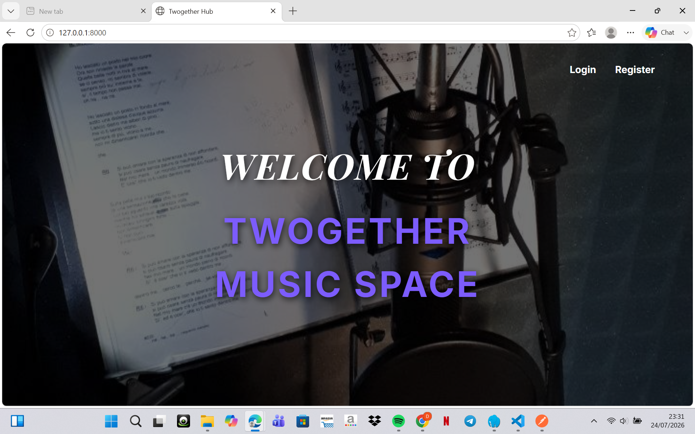

### 2. Login
- Tampilan Login

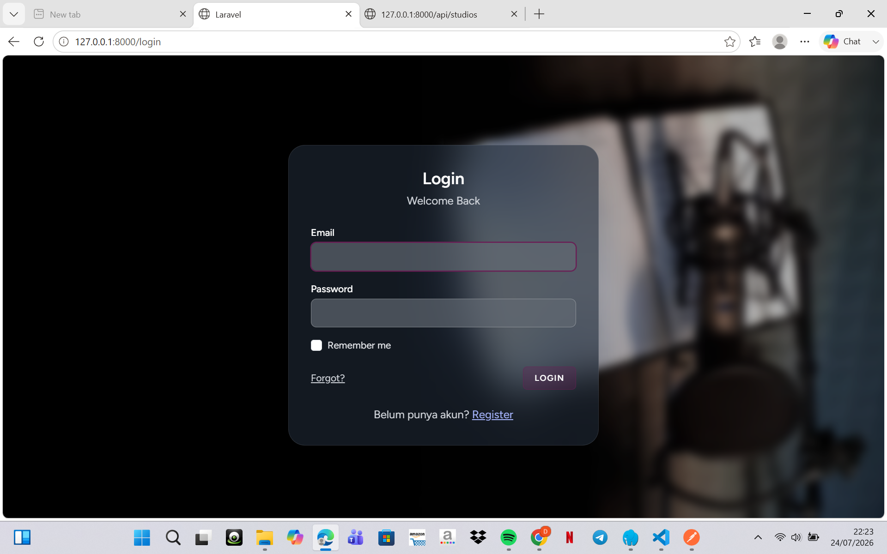


### 3. Register
- Tampilan Register


### 4. Dashboard
- Dashboard Admin
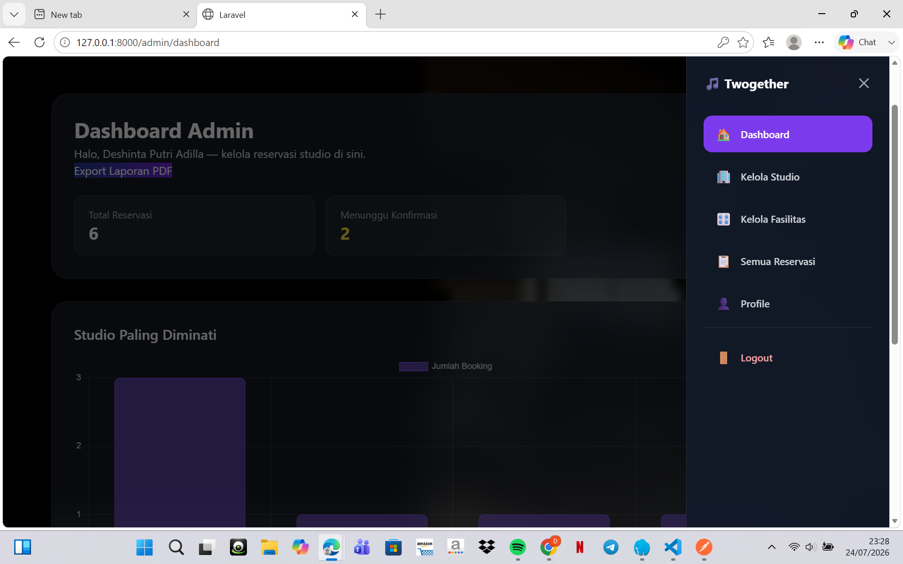

- Dashboard User
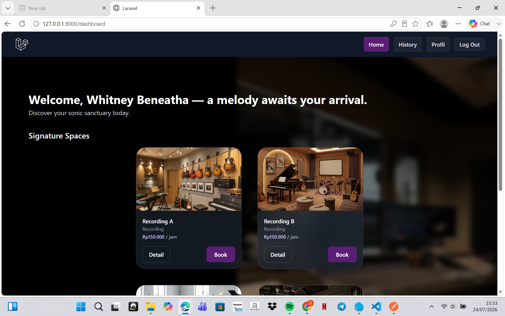

### 5. CRUD (Create, Read, Update, Delete)
- Booking Studio
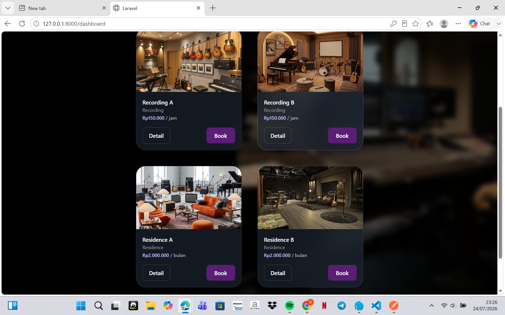

- Reservasi & Verifikasi oleh Admin
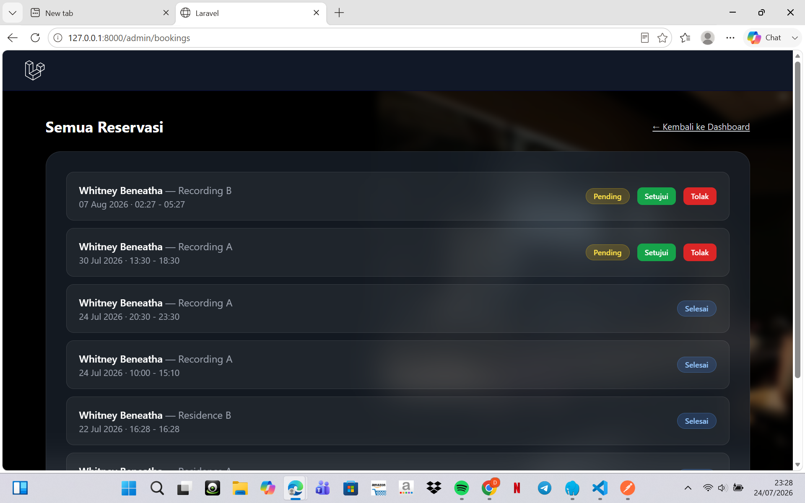

- Kelola Studio
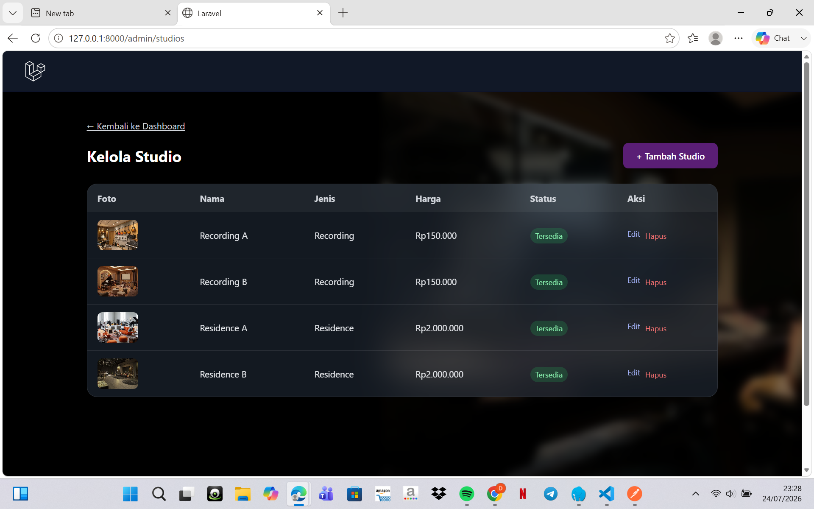

### 6. REST API (Pengujian di Postman)
- GET semua studio
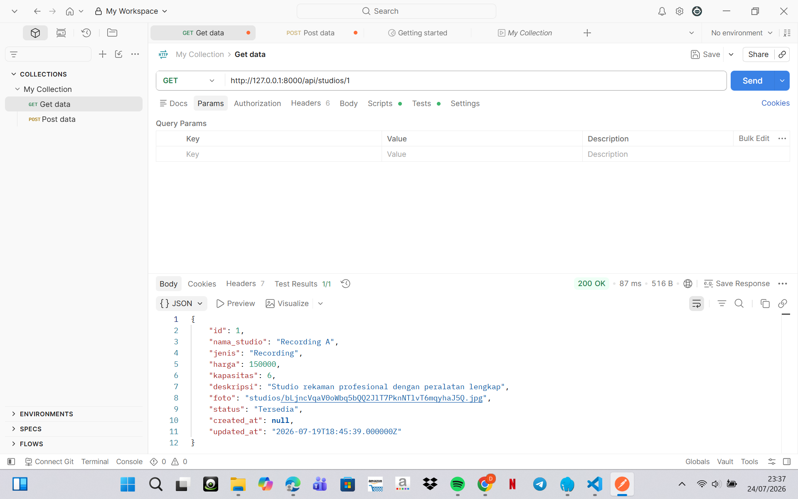

- POST tambah studio
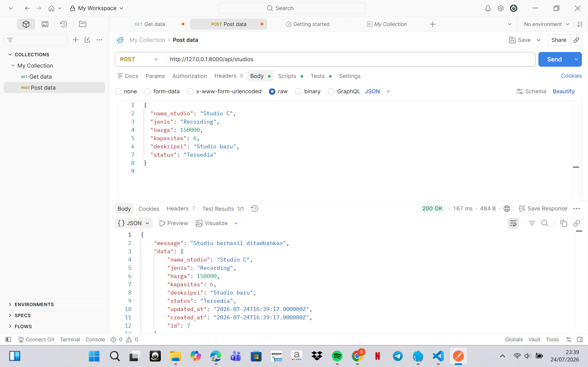

- PUT update studio
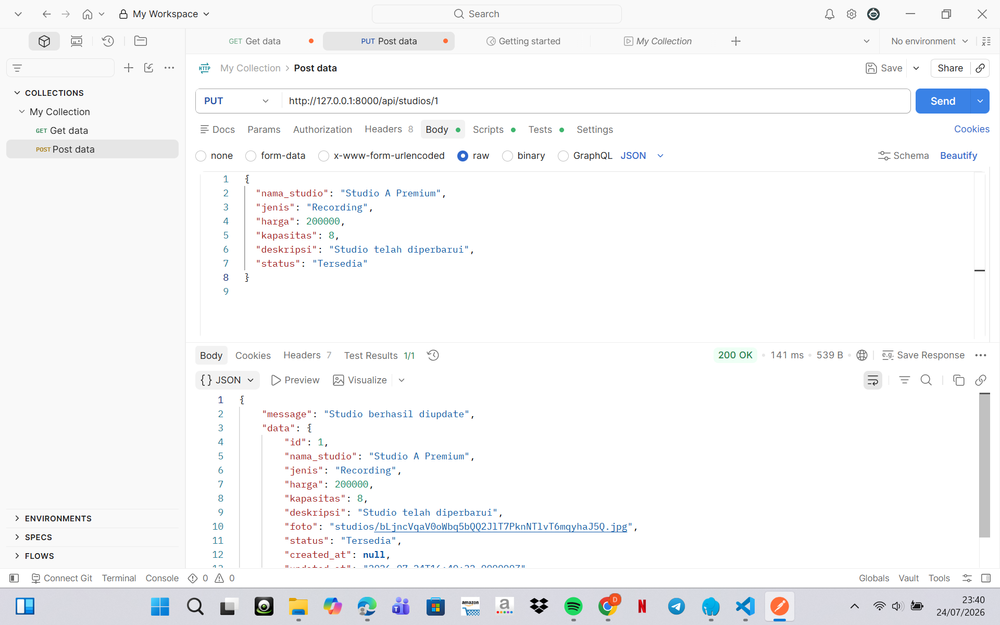

- DELETE studio: `docs/screenshots/12-delete-API.png.png`
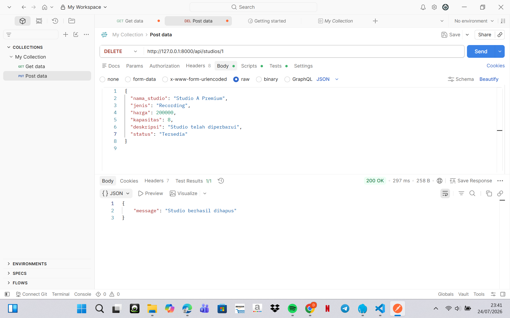


### 7. Tampilan Responsive (Mobile)
`docs/screenshots/13-mobile.png.png`

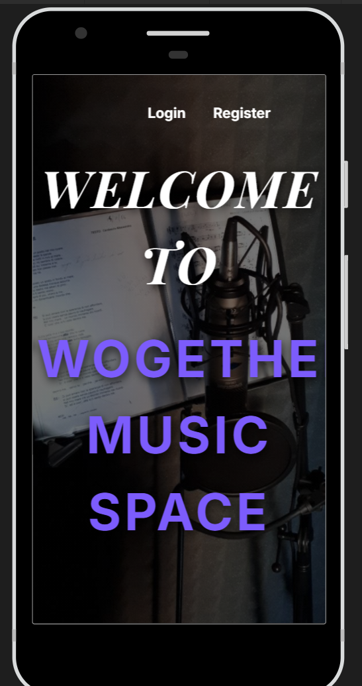

### 8. Hasil Export PDF
`docs/screenshots/14-export-pdf.png.png`

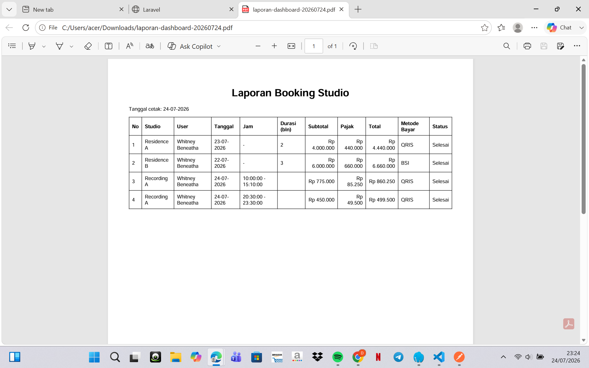

---

## 📁 Struktur Direktori Penting

```
app/Http/Controllers/
├── Admin/                # Controller khusus admin (Dashboard, Profile)
├── Api/                  # Controller REST API (StudioApiController)
├── Auth/                 # Controller autentikasi bawaan Breeze
├── BookingController.php
├── StudioController.php
├── FacilityController.php
├── PaymentController.php
└── ReceiptController.php # Export PDF struk

app/Models/
├── User.php
├── Studio.php
├── Facility.php
└── Booking.php

resources/views/
├── admin/                # View untuk role admin
├── user/                 # View untuk role user
├── auth/                 # Login, register
└── receipt/pdf.blade.php # Template struk PDF
```

---

## 🧪 Menjalankan Test

```bash
php artisan test
```