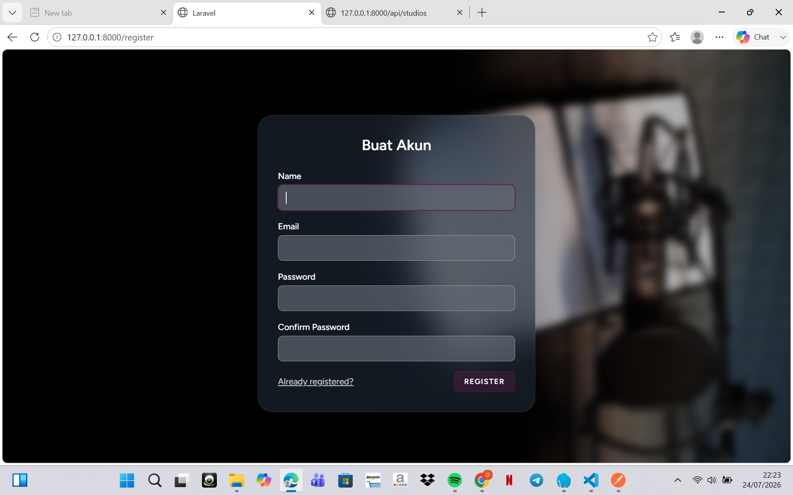

<<<<<<< HEAD
# 🎙️ Twogether Hub

Twogether Hub adalah aplikasi web berbasis **Laravel 13** untuk manajemen **penyewaan (booking) studio** — mendukung studio bertipe *Recording* dan *Residence*. Aplikasi ini memiliki dua peran pengguna (**Admin** dan **User**), alur pemesanan lengkap (pilih studio → booking → pembayaran → verifikasi → struk), serta REST API sederhana untuk data studio.

## ✨ Fitur Utama

- **Autentikasi** — Register, Login, Logout, Reset/Konfirmasi Password (Laravel Breeze)
- **Verifikasi Email** — Scaffolding verifikasi email bawaan Breeze (lihat catatan pada bagian *Known Issues*)
- **Login Google (Socialite)** — Package `laravel/socialite` sudah terpasang (lihat catatan pada bagian *Known Issues*)
- **Dashboard** berbeda untuk Admin dan User
- **Manajemen Studio (CRUD)** — tambah, lihat, ubah, hapus data studio beserta foto
- **Manajemen Fasilitas (CRUD)**
- **Booking Studio** — pengecekan bentrok jadwal otomatis, status Pending/Disetujui/Ditolak/Selesai
- **Pembayaran & Verifikasi Pembayaran** oleh Admin
- **Export PDF Struk Booking** (menggunakan `barryvdh/laravel-dompdf`)
- **REST API Studio** (`/api/studios`) — CRUD studio via JSON
- **Hak Akses Admin vs User** — middleware `admin` khusus rute `/admin/*`
- **Tampilan Responsive** — Tailwind CSS + Alpine.js

## 👤 Identitas Pengembang

| Item | Keterangan |
|---|---|
| Nama | Deshinta Putri Adilla |
| NIM | 240170099 |

---

## 🛠️ Tech Stack

- **Backend**: PHP 8.3, Laravel 13
- **Frontend**: Blade, Tailwind CSS, Alpine.js, Vite
- **Database**: SQLite (default) — bisa diganti ke MySQL
- **Autentikasi**: Laravel Breeze
- **Login Sosial**: Laravel Socialite (Google)
- **PDF**: barryvdh/laravel-dompdf
- **Testing**: Pest PHP

---

## 🚀 Cara Instalasi & Menjalankan Aplikasi

### 1. Prasyarat
- PHP >= 8.3
- Composer
- Node.js & NPM
- Ekstensi PHP: `pdo_sqlite` (atau `pdo_mysql` jika pakai MySQL), `mbstring`, `openssl`, `fileinfo`

### 2. Clone / Extract Project
```bash
git clone <url-repo-anda>.git twogether-hub
cd twogether-hub
```

### 3. Install Dependency PHP & JS
```bash
composer install
npm install
```

### 4. Konfigurasi Environment
```bash
cp .env.example .env
php artisan key:generate
```

Buka file `.env` dan sesuaikan konfigurasi berikut:

```env
# Database (default sudah SQLite, tidak perlu diubah jika ingin pakai SQLite)
DB_CONNECTION=sqlite

# Jika ingin memakai MySQL, ubah menjadi:
# DB_CONNECTION=mysql
# DB_HOST=127.0.0.1
# DB_PORT=3306
# DB_DATABASE=twogether_hub
# DB_USERNAME=root
# DB_PASSWORD=

# Konfigurasi email (untuk fitur verifikasi email)
MAIL_MAILER=smtp
MAIL_HOST=smtp.mailtrap.io
MAIL_PORT=2525
MAIL_USERNAME=
MAIL_PASSWORD=
MAIL_FROM_ADDRESS="hello@twogetherhub.test"
MAIL_FROM_NAME="${APP_NAME}"

# Kredensial Google OAuth (jika ingin mengaktifkan Login Google)
GOOGLE_CLIENT_ID=
GOOGLE_CLIENT_SECRET=
GOOGLE_REDIRECT_URI=http://localhost:8000/auth/google/callback
```

> Jika menggunakan SQLite, buat dulu file database-nya (biasanya sudah ada di `database/database.sqlite`, jika belum ada jalankan):
> ```bash
> touch database/database.sqlite
> ```

### 5. Migrasi & Seeder Database
```bash
php artisan migrate --seed
```

Seeder default akan membuat 1 akun user:
- Email: `test@example.com`
- Password: sesuai factory default Laravel (`password`)

Untuk membuat **akun Admin**, jalankan Tinker lalu update role user menjadi `admin`:
```bash
php artisan tinker
```
```php
$user = App\Models\User::first();
$user->role = 'admin';
$user->email_verified_at = now();
$user->save();
```

### 6. Build Asset Frontend
```bash
npm run build
# atau untuk mode development:
npm run dev
```

### 7. Jalankan Aplikasi
```bash
php artisan serve
```
Aplikasi dapat diakses melalui: `http://127.0.0.1:8000`

Atau jalankan sekaligus server + queue + vite dengan satu perintah:
```bash
composer run dev
```

### 8. Storage Link (untuk foto studio/profil)
```bash
php artisan storage:link
```

---

## 🔑 Akun Demo

| Role | Email | Password |
|---|---|---|
| User | `whitneyatha@gmail.com` | `yoojimin` |
| Admin | deshintaadilla@gmail.com | leedonghyuck |

> Aplikasi ini belum memiliki seeder khusus untuk akun Admin, sehingga akun Admin perlu dibuat manual seperti pada instruksi instalasi di atas.

---

## 📡 Dokumentasi REST API

Base URL: `http://127.0.0.1:8000/api`

| Method | Endpoint | Deskripsi |
|---|---|---|
| GET | `/api/studios` | Menampilkan seluruh data studio |
| GET | `/api/studios/{id}` | Menampilkan detail 1 studio |
| POST | `/api/studios` | Menambah studio baru |
| PUT | `/api/studios/{id}` | Mengubah data studio |
| DELETE | `/api/studios/{id}` | Menghapus studio |

Contoh body request `POST /api/studios`:
```json
{
  "nama_studio": "Studio A",
  "jenis": "Recording",
  "harga": 150000,
  "kapasitas": 5,
  "deskripsi": "Studio rekaman full peralatan",
  "status": "Tersedia"
}
```

File koleksi Postman dapat disimpan di `docs/postman/TwogetherHub.postman_collection.json` (export koleksi Anda dari Postman lalu simpan di path tersebut agar terdokumentasi bersama repo).

---

## 📸 Dokumentasi Screenshot

> Daftar di bawah sudah disesuaikan dengan nama file yang ada di `docs/screenshots/`. Jika Anda mengganti/menambah file, sesuaikan juga nama file & urutan di sini agar gambar tetap tampil dengan benar.

### 1. Landing Page
`docs/screenshots/01-landing-page.png`


### 2. Login
`docs/screenshots/02-login.png`


> ⚠️ **Catatan**: fitur Login Google & verifikasi email wajib belum aktif — lihat bagian [Known Issues](#-known-issues--catatan-pengembangan).

### 3. Register
`docs/screenshots/03-register.png`



### 4. Dashboard
- Dashboard Admin: `docs/screenshots/04-dashboard-admin.png`
- Dashboard User: `docs/screenshots/05-dashboard-user.png`


### 5. CRUD (Booking, Reservasi, Kelola Studio)
- Booking Studio: `docs/screenshots/06-booking.png`
- Reservasi & Verifikasi oleh Admin: `docs/screenshots/07-reservasi-oleh-admin.png`
- Kelola Studio: `docs/screenshots/08-kelola-studio.png`


### 6. REST API (Pengujian di Postman)
- GET semua studio: `docs/screenshots/09-get-API.png`
- POST tambah studio: `docs/screenshots/10-post-API.png`
- PUT update studio: `docs/screenshots/11-put-API.png`
- DELETE studio: `docs/screenshots/12-delete-API.png`


### 7. Tampilan Responsive (Mobile)
`docs/screenshots/13-mobile.png`


### 8. Hasil Export PDF Struk Booking
`docs/screenshots/14-export-pdf.png`


> Catatan: struk PDF hanya bisa diunduh setelah status booking menjadi **"Selesai"** (pembayaran sudah diverifikasi Admin). Fitur export ini menghasilkan **PDF**; belum ada fitur export ke **Excel** pada versi kode saat ini.

---

## 📁 Struktur Direktori Penting

```
app/Http/Controllers/
├── Admin/                # Controller khusus admin (Dashboard, Profile)
├── Api/                  # Controller REST API (StudioApiController)
├── Auth/                 # Controller autentikasi bawaan Breeze
├── BookingController.php
├── StudioController.php
├── FacilityController.php
├── PaymentController.php
└── ReceiptController.php # Export PDF struk

app/Models/
├── User.php
├── Studio.php
├── Facility.php
└── Booking.php

resources/views/
├── admin/                # View untuk role admin
├── user/                 # View untuk role user
├── auth/                 # Login, register, verifikasi email
└── receipt/pdf.blade.php # Template struk PDF
```

---

## 🧪 Menjalankan Test

```bash
php artisan test
```
=======

>>>>>>> c4d010a838cc5e09c9c62922a16cb7080faca75e
